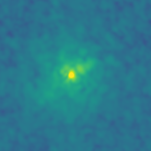

# Optimisation for Volume Rendering of 3D Datacubes
Group 15; 
NG, Cheuk Nam (cnng@kth.se) Expected Grade A
Wong, Chun Him (chwon@kth.se) Expected Grade B
Git Repository for Project Code:
[https://github.com/anson-ryea/dd2358-work/tree/main/project](https://github.com/anson-ryea/dd2358-work/tree/main/project)
# Problem Statement
In this project, the characteristics of a ray-casting volume rendering algorithm implemented in Python by Philip Mocz were first profiled and analysed, then optimised through 3 different methods including parallelisation, pre-compilation and offloading to GPU calculations.

The original code implements ray-casting volume rendering of three-dimensional scalar field data, originally developed to visualise outputs from a Schrödinger–Poisson simulation. The render_original function begins by loading a density datacube from an HDF5 file using h5py, then constructs a uniform Cartesian coordinate grid spanning the datacube dimensions. For each of Nangles viewing angles, the camera grid, a cubic mesh of N³ query points, is rotated about the x-axis by incrementing the angle uniformly from $0$ to $π/2$. The rotated query coordinates are passed to `scipy.interpolate.interpn`, which performs trilinear interpolation of the datacube onto the camera grid. Volume rendering is then performed by iterating through depth slices of the interpolated grid. For each slice, the `transferFunction` applies Gaussian-weighted colour and opacity mappings (RGBA) as a function of the log-density value, compositing each slice onto the accumulating image via front-to-back alpha blending. The final image is clipped to $[0, 1]$ and saved as a PNG. After all angles are rendered, a simple mean-projection image is additionally saved using a viridis colormap for reference comparison.
# Original Code
Despite the original code can be found in the file https://github.com/pmocz/volumerender-python/blob/main/volumerender.py. The original `main()` has been renamed to `render_original()`. `path`, `N` and `Nangles` are also added as arguments for the path to the datacube, the camera grid size and the number of viewing angles, respectively. The print line for rendering progress has been commented out to avoid cluttering the profiling results. The original datacube file that could be found in the original repository is renamed to`datacube_original.hdf5`.
# Platform
All the profiling is done on a MacBook Air with Apple M4 chip, which has 10 CPU cores and 24GB of unified memory. GPU acceleration tests are run with Metal Performance Shaders.
# Profiling the Original Source Code
## Tools

As all the profiling and testing of the original code was done in the notebook file `project.ipynb`, most of the profiling tools we used are the notebook-compatible versions.

- `%prun`: a magic command that provides the same functionality as the cProfile module.
- `%lprun`: a magic command that provides line-by-line profiling of functions.
- `%mprun`: a magic command that provides memory profiling of functions.
- `time`: to measure the running time of parts of the code.
## Profiling the functions

Before diving deep in to a detailed profiling of the original code, `prun` was run against the original file with original parameters ($N=180, Nangles=10$) to get a high-level idea of how the original code performs. Based on the profiling result that contains the cumulative time used by each function, we can see that the most time-consuming parts of the code unsurprisingly comes from the `render_original` function, line-by-line profiling to this function can be done to further identify the bottlenecks. We can also see that the `interpn` function used for interpolation takes most of the time out of `render_original`, optimisation can be done with the interpolation step.

             428206 function calls (420265 primitive calls) in 7.585 seconds
       ncalls  tottime  percall  cumtime  percall filename:lineno(function)
            1    0.460    0.460    7.581    7.581 renderer_original.py:37(render_original)
           10    0.058    0.006    4.361    0.436 _rgi.py:645(interpn)
         1800    2.098    0.001    2.098    0.001 renderer_original.py:13(transferFunction)

> See Section 4.1 of `project.ipynb` for the original code and full results.
## Line-by-line profiling

### `render_original()`

Line-by-line profiling reveals that the interpolation step (`camera_grid = interpn(points, datacube, qi, method="linear").reshape((N, N, N))`) constitutes the primary performance bottleneck, accounting for a substantial portion (60.4%) of total execution time. The `transferFunction` represents the second-most time-intensive (28.9%) operation, largely due to its high hit rate. These findings suggest that optimisation efforts should prioritise the interpolation step, whilst exploring opportunities to reduce or parallelise the angle-rendering loop, which may yield significant performance improvements.
    
    Total time: 7.76715 s
    Line #      Hits         Time  Per Hit   % Time  Line Contents
    ==============================================================
        65        10 4691227000.0 4.69e+08     60.4          camera_grid = interpn(points, datacube, qi, method="linear").reshape((N, N, N))
        71      1800 2241440000.0 1.25e+06     28.9              r, g, b, a = transferFunction(np.log(dataslice))

> See Section 4.2.1 of `project.ipynb` for the original code and full results.
### `transferFunction()`

Despite the `transferFunction()` takes the second-most time-intensive when running the `render_original()` function, profiling results show that each of the arithmetic operations for each colour channel takes the same time.

> See Section 4.2.2 of `project.ipynb` for the original code and full results.
## Memory profiling

Some insights can be seen from the above memory profiling results. We can see that the memory increment does not primarily come from the two functions, but rather from the `datacube = np.array(f["density"])` loads the entire HDF5 dataset into memory at once. Futher optimisations can be done in managing memory usage to reduce memory footprint and avoid swapping as much as possible.
### `render_original()`
    
    Line #    Mem usage    Increment  Occurrences   Line Contents
    =============================================================
        37   1449.9 MiB   1449.9 MiB           1   def render_original(path, N, Nangles):
### `transferFunction()`
    
    Line #    Mem usage    Increment  Occurrences   Line Contents
    =============================================================
        13   1453.7 MiB   1453.7 MiB        1800   def transferFunction(x):

> See Section 4.3 of `project.ipynb` for the original code and full results.
## Investigating different factors affecting the performance

## Generating datacubes with different sizes

In order to have more datacubes as a standardised dataset for further benchmarks, a piece of code is written to generate datacubes of the provided size  $[100^3, 1000^3]$ with a spherical density distribution inside a black void. The datacubes are saved in HDF5 format, and the generation is done slice-by-slice to maintain a low memory footprint. Each datacube file can later be used for benchmarking the rendering performance with varying datacube sizes.

> See Section 5.1 of `project.ipynb` for the original code and full results.
## Variable Datacube Sizes

A helper function for benchmarking is written to run the `render_original` function on datacubes of varying sizes, measuring the execution time for each size. The following parameters are used:
- Datacube size: $[300-1000]$ with a step of $100$
- Camera grid size (N): $180$ (same as the original code)
- Number of viewing angles (Nangles): $10$ (same as the original code)
- Number of runs: $5$ (to get an average and standard deviation for each size)

```hblock
![[螢幕截圖 2026-03-12 09.12.15.png]]

---

| Datacube Size | Average Time (s) | Std Dev (s) |
| :------------ | :--------------- | :---------- |
| Original      | 7.3485           | 0.0317      |
| 300           | 7.3662           | 0.0141      |
| 400           | 7.3926           | 0.0328      |
| 500           | 7.5264           | 0.0536      |
| 600           | 7.6381           | 0.0444      |
| 700           | 7.7385           | 0.1272      |
| 800           | 7.6513           | 0.1914      |
| 900           | 8.3336           | 0.6450      |
| 1000          | 8.2817           | 0.4094      |
```

We may observe that increasing the datacube size (from 300 to 1000) for a fixed camera grid `N` does not significantly increase the rendering time. This is because the volume rendering complexity in this implementation is primarily determined by the camera grid dimensions (`N`). The interpolation step (`interpn`) maps values from the original datacube to the camera grid query points. The number of query points is `N*N*N`.
While a larger valid domain in the datacube might slightly affect memory access patterns, the total number of interpolation operations remains constant ($N^3$) regardless of the source datacube's resolution.
We can conclude that the rendering performance shall be consider independent of the datacube size.

> See Section 5.2 of `project.ipynb` for the original code and full results.

## Variable Camera Grid Sizes

A helper function for benchmarking is written to run the `render_original` function on a fixed datacube size but variating the output image size, measuring the execution time for each size. The following parameters are used:
- Datacube size: $600$
- Camera grid size (N): $[100,400]$ with a step of $100$
- Number of viewing angles (Nangles): $10$ (same as the original code)
- Number of runs: $5$
```hblock
![[螢幕截圖 2026-03-12 09.13.00.png]]

---

| Cube Source   | Camera Grid (N) | Average Time (s) | Std Dev (s) |
| :------------ | :-------------- | :--------------- | :---------- |
| Original Cube | **180**         | 7.4257           | 0.0301      |
| Size 600      | **100**         | 1.6008           | 0.0313      |
| Size 600      | **200**         | 10.5382          | 0.5187      |
| Size 600      | **300**         | 34.8591          | 0.8238      |
| Size 600      | **400**         | 110.7556         | 4.1012      |
```

From the above results, we can see that the rendering time increases significantly with increasing camera grid size `N`. This is expected since the number of interpolation points scales as `N^3`, leading to a cubic increase in computational workload. The interpolation step becomes increasingly expensive as `N` grows, which is reflected in the execution times. Therefore, optimising the interpolation step or reducing the number of query points could be crucial for improving performance when using larger camera grids.

We can also see that the standard deviation of the execution times also increases with `N`, which may indicate that larger camera grids are more sensitive to memory access patterns.

> See Section 5.3 of `project.ipynb` for the original code and full results.
## Variable Camera Angle Counts

A helper function for benchmarking is written to run the `render_original` function on a fixed datacube size, fixed the output image size but variating camera angles to render, measuring the execution time for each angle counts. The following parameters are used:
- Datacube size: Original hdf5
- Camera grid size (N): $180$
- Number of viewing angles (Nangles): $[5,30]$
- Number of runs: $5$
```hblock
![[螢幕截圖 2026-03-12 09.13.48.png]]

---

| Camera Angles (Nangles) | Average Time (s) | Std Dev (s) |
| :---------------------- | :--------------- | :---------- |
| **5**                   | 3.8009           | 0.2560      |
| **10**                  | 7.4133           | 0.0713      |
| **15**                  | 11.0125          | 0.0172      |
| **20**                  | 14.6789          | 0.0111      |
| **25**                  | 18.3406          | 0.0239      |
| **30**                  | 21.9904          | 0.0468      |
```

It is trivial to see that the rendering time is linearly proportional to the number of angles, as the rendering loop of the original code iterates over each angle independently. The total execution time will scale directly with the number of angles, making it a straightforward relationship.

> See Section 5.4 of `project.ipynb` for the original code and full results.
# Optimisations

Before diving into details, it is important to note that our optimisations done are focused on shortening the execution time of the original program.

Also, all GPU optimisations targeted Apple Silicon instead of NVIDIA as we have run out of quota on Colab and Azure.

To ensure that the optimised version output the same results as the original, validation tests make use of the original datacube that comes with the original repository. The projection rendered by the original algorithm is compared to the optimised version and they should be identical.
## Optimisation 1: Rewriting with PyTorch

Since the original datacube contains floating-point values and GPUs are purpose-built for concurrent floating-point calculations, we expect this approach to yield significant performance gains over the original implementation.

When compared to the original NumPy-based implementation, this PyTorch version shifts from CPU processing to GPU-accelerated execution. Structurally, the renderer_torch.py script replaces `scipy.interpolate.interpn` with `torch.nn.functional.grid_sample` for the core 3D interpolation task.

The density datacube is loaded and converted into a PyTorch tensor. It is then expanded to a 5D shape (Batch, Channel, Depth, Height, Width), which is the specific format required for 3D spatial sampling.

Unlike the original script which uses physical coordinates, this version generates a base coordinate meshgrid constrained to the range $[−1,1]$. This is mandatory for the grid_sample function to map coordinates to the source volume.

Inside the angle loop, the base grid is rotated using trigonometric tensor operations. These coordinates are stacked into a 5D grid tensor, specifically ordered as (Width, Height, Depth) to match the expected spatial dimensions of the sampler. The grid_sample function performs 3D trilinear interpolation, sampling the source density volume at the rotated coordinates. This offloads the most computationally intensive $O(N^3)$ operation from the CPU to the GPU's specialised texture units. A clamped logarithm is applied to the entire interpolated grid in a single pass to prepare the data for the transfer function.

The alpha-compositing loop iterates through the depth slices of the volume. For each slice, the transfer function calculates RGBA values using torch GPU calculations, which are then blended into the final 2D image buffer using an iterative accumulation formula.

Only after the rendering is complete is the final 2D image clamped and moved from the GPU back to the CPU.
### Benchmarking

#### Variable Datacube Grid Size

```python
run_size_benchmark(render_torch)
```

```hblock
![[螢幕截圖 2026-03-12 00.54.33.png]]

---

| Datacube Size | Average Time (s) | Std Dev (s) |
| :------------ | :--------------- | :---------- |
| Original      | 1.3908           | 0.8836      |
| 300           | 0.9995           | 0.0498      |
| 400           | 1.0443           | 0.0180      |
| 500           | 1.5662           | 0.9645      |
| 600           | 1.2881           | 0.3456      |
| 700           | 1.6996           | 0.8008      |
| 800           | 1.5500           | 0.4118      |
| 900           | 2.1257           | 1.0942      |
| 1000          | 5.6876           | 6.4414      |
```

 From the above results, we can see that the rendering time is reduced significantly (7x, 7.34s for size 300 originally) for smaller datacube sizes when compared to the original version. However, despite the rendering time stayed almost constant for smaller datacubes similar to the original version, the rendering time starts to increases for larger datacubes (600 and above), which may be due to the number of concurrent calculations exceeding the GPU's capacity.
#### Variable Camera Grid Size

```python
run_n_benchmark(render_torch)
```

```hblock
![[螢幕截圖 2026-03-12 00.54.07.png]]

---

| Cube Source   | Camera Grid (N) | Average Time (s) | Std Dev (s) |
| :------------ | :-------------- | :--------------- | :---------- |
| Original Cube | **180**         | 0.9167           | 0.0265      |
| Size 600      | **100**         | 1.2621           | 1.2402      |
| Size 600      | **200**         | 1.2728           | 0.0204      |
| Size 600      | **300**         | 3.4994           | 0.8100      |
| Size 600      | **400**         | 9.7609           | 6.6061      |
| Size 600      | **500**         | 11.9701          | 1.2773      |
```

Improvement is observed for all camera grid sizes with a reduction of around 8x-10x (110s for $N=400$ originally) in rendering time.
#### Variable Camera Angles

```python
run_angles_benchmark(render_torch, num_runs=10)
```

```hblock
![[螢幕截圖 2026-03-12 01.11.15.png]]

---

| Camera Angles (Nangles) | Average Time (s) | Std Dev (s) |
| :---------------------- | :--------------- | :---------- |
| **5**                   | 0.5050           | 0.0593      |
| **10**                  | 0.9318           | 0.0176      |
| **15**                  | 1.3767           | 0.0487      |
| **20**                  | 1.7658           | 0.0535      |
| **25**                  | 2.9946           | 0.4794      |
| **30**                  | 4.1469           | 0.1248      |
```

We can see that the rendering time is significantly reduced for all angles, with a reduction of around 5x-7x (3.8s for 5 angles originally) in rendering time. The linear relationship between rendering time and number of angles is still observed, which is expected since the angle loop is not parallelised in this version.

> See Section 6.1 of `project.ipynb` for the original code and full results.
## Limitation, Other Performance Indicators

One limitation with this implementation is that we noticed the performance is heavily bounded by the available graphics memory. In some of the above benchmarks, we can see that in larger datasets, the profiling results tend to give a larger standard deviation, as we inspected the Task Manager, we noticed that swapping was done frequently. Memory needed was roughly the same as the original version, roughly 16GBs for a size 600 datacube.
## Validation Test
```hblock

> Original
---
---
---

> Torch
```
## Optimisation 2: Parallelising angles rendering with Dask Delayed

As we could observe that one of the bottlenecks of the original code is the angle rendering loop, and it shall be able to be parallelised as each of the rendering is not related. This version of optimisation make use of Dask Delayed to build a task graph for rendering each angle, and then compute them in parallel.

The datacube is scattered to the workers once, and the Future pointer is passed to each task to avoid redundant data transfer. The interpolation step is still done with `scipy.interpolate.interpn` just like the original version. However, to reduce the memory footprint, we made use of a the `scatter` function provided by Dask to reduce unnecessary data copying among the workers. 10 workers are deployed for the 10-core machine.

### Benchmarking

#### Variable Datacube Grid Size

```python
run_size_benchmark(render_dask, range(300,700,100))
```

```hblock
![[螢幕截圖 2026-03-12 09.24.34.png]]

---

| Datacube Size | Average Time (s) | Std Dev (s) |
| :------------ | :--------------- | :---------- |
| Original      | 3.8753           | 0.4234      |
| 300           | 3.0421           | 0.0154      |
| 400           | 2.9645           | 0.0229      |
| 500           | 3.4037           | 0.0959      |
| 600           | 5.2997           | 1.5668      |
```

This part of profiling shows an interesting result. It can be seen that the rendering time is roughly half of the original version (7.34 for size 300 in original). However, a spike in rendering time is observed for the datacube of size 600, it was due to the fact that the machine was throttling due to the high memory usage.

#### Variable Camera Grid Size


```python
run_n_benchmark(render_dask, target_size=600)
```

```hblock
![[螢幕截圖 2026-03-12 09.48.36.png]]

---

| Cube Source   | Camera Grid (N) | Average Time (s) | Std Dev (s) |
| :------------ | :-------------- | :--------------- | :---------- |
| Original Cube | **180**         | 3.6244           | 0.5886      |
| Size 600      | **100**         | 2.3803           | 0.7126      |
| Size 600      | **200**         | 6.2433           | 0.7794      |
| Size 600      | **300**         | 27.4269          | 2.9153      |
| Size 600      | **400**         | 59.8244          | 1.8765      |
| Size 600      | **500**         | 118.0199         | 3.8696      |
```

We could see that from that reductions in rendering time become more significant with increasing camera grid size, with a factor of around 2x at $N = 400$ (110s in original) . However, for smaller camera grid sizes, the reduction is not significant or even worse, which may be due to the overhead of parallelisation outweighing the benefits when the workload is smaller.

#### Variable Camera Angles


```python
run_angles_benchmark(render_dask, num_runs=5)
```

```hblock
![[螢幕截圖 2026-03-12 09.55.01.png]]

---

| Camera Angles (Nangles) | Average Time (s) | Std Dev (s) |
| :---------------------- | :--------------- | :---------- |
| **5**                   | 1.9827           | 0.0554      |
| **10**                  | 3.0875           | 0.0349      |
| **15**                  | 4.7476           | 0.1119      |
| **20**                  | 6.0158           | 0.0724      |
| **25**                  | 8.1679           | 0.2737      |
| **30**                  | 13.1673          | 1.4959      |
```

The rendering time is significantly reduced for all angles, with a factor of around 2x (3.8 for 5 angles in orginal) in rendering time. However, one original expectation is that the rendering time should be reduced by a factor of near 10x, due to the fact that 10 workers were deployed and they have a balanced workload as observed from the Dashboard. The less-than-expected reduction may be due to the overhead of parallelisation and task scheduling, or the single-threaded nature of `interpn`.

> See Section 6.2 of `project.ipynb` for the original code and full results.

## Limitations and Other Performance Indicators

From Dask Dashboard, we would see that the load across the workers deployed is quite balanced.
```hblock
![[螢幕截圖 2026-03-12 09.17.30.png]]
---
However, this approach uses significantly more memory (With Dask: $23GB$ of RAM for size 600; All other versions: $16GB$ of RAM) despite the datacube is already scattered to the workers. As a result, the machine starts to swap memory which leads to a significant increase in rendering time. This also explains why the benchmark for size 700 and above in variable datacube sizes benchmarking is skipped, as the rendering time is expected to be even higher and more fluctuateddue to more memory usage.

```
## Validation Test
```hblock

> Original
---
---
---

> Dask
```
## Optimisation 3: Optimise with Cython

This optimisation mainly focuses on precompiling the most time-consuming parts of the code (the transfer function and the interpolation) with Cython. The `transferFunction` is rewritten in Cython to allow for inlining and direct use of C math functions, which can significantly reduce overhead.

Apart from simply annotating the original functions and variables with Cython types. The interpolation is also implemented manually in Cython to avoid the overhead of calling `scipy.interpolate.interpn` and to allow for more efficient memory access patterns. The manual trilinear interpolation function computes the interpolated value at a given point by directly accessing the eight surrounding voxel values and applying the trilinear interpolation formula, which can be significantly faster than the general-purpose `interpn` function for this specific use-case.

Only 5 lines of code required to call back to Python after optimising with Cython, such report. can be seen at `renderer_cython_fun`.
### Benchmarking

#### Variable Datacube Grid Size

```python
run_size_benchmark(render_cython)
```

```hblock
![[螢幕截圖 2026-03-12 01.10.30.png]]

---

| Datacube Size | Average Time (s) | Std Dev (s) |
| :--- | :--- | :--- |
| Original | 1.8070 | 0.1075 |
| 300 | 1.3011 | 0.0316 |
| 400 | 1.3394 | 0.0359 |
| 500 | 1.7570 | 0.7171 |
| 600 | 1.8830 | 0.6521 |
| 700 | 1.6210 | 0.1506 |
| 800 | 2.2320 | 0.7822 |
| 900 | 2.5857 | 1.0907 |
| 1000 | 2.6196 | 0.4495 |

```

It can be observed that the rendering time is significantly reduced for all datacube sizes, with a reduction of around 4x-6x (7.34s for size 300 in original) in rendering time, while achieving a similar level of performance improvement as the PyTorch GPU-accelerated version.
#### Variable Camera Grid Size

```python
run_n_benchmark(render_cython)
```

```hblock
![[螢幕截圖 2026-03-12 01.08.18.png]]

---

| Cube Source   | Camera Grid (N) | Average Time (s) | Std Dev (s) |
| :------------ | :-------------- | :--------------- | :---------- |
| Original Cube | **180**         | 1.7039           | 0.0717      |
| Size 600      | **100**         | 0.5965           | 0.0930      |
| Size 600      | **200**         | 1.8477           | 0.0091      |
| Size 600      | **300**         | 6.3142           | 0.0583      |
| Size 600      | **400**         | 18.7056          | 0.1586      |
| Size 600      | **500**         | 45.8751          | 0.3226      |

```

Improvement is observed for all camera grid sizes with a reduction of around 6x (110s for camera grid size 500 in original) in rendering time.
#### Variable Camera Angles

```python
run_angles_benchmark(render_cython, num_runs=5)
```

```hblock

![[螢幕截圖 2026-03-12 01.09.46.png]]

---

| Camera Angles (Nangles) | Average Time (s) | Std Dev (s) |
| :---------------------- | :--------------- | :---------- |
| **5**                   | 0.8842           | 0.0269      |
| **10**                  | 1.8556           | 0.1965      |
| **15**                  | 2.8465           | 0.7834      |
| **20**                  | 3.4850           | 0.4775      |
| **25**                  | 4.2073           | 0.4894      |
| **30**                  | 5.2151           | 0.4977      |
```

The profiling result gives a slightly slower result with Optimisation 1, the PyTorch version. 
The rendering time is reduced for all angles, with a reduction of around 4x (3.8s for 5 angles originally) in rendering time. 

> See Section 6.3 of `project.ipynb` for the original code and full results.
## Limitations and Other Performance Indicators

One of the limitations that we have encountered with Cython is that is it only compatible with CPU calculations. That means if we want to make use of GPU for the floating-point calculations, we have to rely on other pre-compilation methods such as `torch compile`. Nonetheless, Cython optimisation gives way better performance than we have expected, as the performance is comparable with PyTorch where its calculations are concurrent in GPU. This method also shows slightly reduced memory usage than all other methods, we suspect it might actually due to the annotated types, so there is no need for overheads in storing datagrids.
## Validation Test
```hblock

> Original
---
---
---

> Cython
```
# Accumulated Optimisation with Multiple Techniques

This version tries to put different optimisation techniques together to achieve the best possible performance. However, it uses different tools or libraries when compared to the previous separated optimisations, as they were not operating on the same hardware stack or introduce unnecessary overhead when combined. For example, the Cython version is focused on single-threaded performance improvements and would not benefit from GPU acceleration. This final version was written on top of the PyTorch GPU-accelerated version from Optimisation 1.

The only difference applied to the `transfer_function_ultimate` is that the spatial differences are only calculated once. The core `render_ultimate` function enforces execution on the MPS device to guarantee hardware acceleration. The HDF5 density datacube is loaded and immediately transferred to the GPU as a 32-bit floating-point PyTorch tensor. It is expanded into a five-dimensional shape, representing batch, channel, depth, height, and width, which is the requisite format for hardware-accelerated 3D sampling, just like the previous implmentation for Optimisation 1. However this version employs dynamic memory batching, to make sure that all the GPU cores can be fully utilised, so that if a camera angle doesn't fill up all the capacity of it, we put it in the same batch so it can be processed together in a single pass. Each batch has a size that is comparable to the testing platform's GPU usable memory (16GB).

A base 3D coordinate system is generated using `torch.meshgrid` with normalised coordinates ranging $[-1,1]$. The rendering logic then iterates through the total number of requested angles in chunks defined by the calculated batch size. For each batch, a tensor of rotation angles is generated, and trigonometric transformations are applied simultaneously across all frames using tensor broadcasting.  The source volume is virtually expanded to match the batch size without allocating new memory, and `torch.nn.functional.grid_sample` executes parallel trilinear interpolation to map the rotated coordinates back to the density data.

After interpolation, the transfer function is applied to the entire batch of sampled grids in one operation. Once all angles are processed, the final images are clamped and transferred back to the CPU for saving. Once all CPU-resident batches are concatenated, and a `ThreadPoolExecutor` asynchronously maps the saving function across the array, executing the disk writes in parallel.
### Benchmarking

#### Variable Datacube Grid Size

```python
run_size_benchmark(render_ultimate)
```

```hblock
![[螢幕截圖 2026-03-12 00.56.18.png]]

---

| Datacube Size | Average Time (s) | Std Dev (s) |
| :------------ | :--------------- | :---------- |
| Original      | 0.6665           | 0.2755      |
| 300           | 0.5583           | 0.0080      |
| 400           | 0.6440           | 0.0394      |
| 500           | 0.7723           | 0.1277      |
| 600           | 0.8556           | 0.1828      |
| 700           | 1.0461           | 0.2680      |
| 800           | 1.7143           | 0.8572      |
| 900           | 2.0871           | 1.1646      |
| 1000          | 5.3564           | 1.1884      |
```

For smaller grids, it also exhibits a significant reduction in rendering time (7x, 3.8s for size 300 in original) when compared to the original version. However, for larger datacubes (600 and above), the rendering time starts to increase, which may be due to the fact that the number of concurrent calculations exceeds the GPU's capacity, similar to the previous Pytorch implementation.
#### Variable Camera Grid Size

```python
run_n_benchmark(render_ultimate)
```

```hblock
![[螢幕截圖 2026-03-13 14.22.40.png]]
---
| Cube Source   | Camera Grid (N) | Average Time (s)                      | Std Dev (s) |
| :------------ | :-------------- | :------------------------------------ | :---------- |
| Original Cube | **180**         | 0.5398                                | 0.0329      |
| Size 600      | **100**         | 1.1111                                | 1.7425      |
| Size 600      | **200**         | 1.7121                                | 1.4081      |
| Size 600      | **300**         | 6.3761                                | 5.0790      |
| Size 600      | **400**         | 7.1879                                | 0.2307      |
```

An average reduction of 8x-16x (110s for size 600 in original) in rendering time is observed for all camera grid sizes, with the most significant improvements seen at larger grid sizes.
#### Variable Camera Angles

```python
run_angles_benchmark(render_ultimate, num_runs=5)
```

```hblock
![[螢幕截圖 2026-03-12 00.56.58.png]] 

--- 

| Camera Angles (Nangles) | Average Time (s) | Std Dev (s) |
| :---------------------- | :--------------- | :---------- |
| **5**                   | 0.2910           | 0.1074      |
| **10**                  | 0.5183           | 0.0177      |
| **15**                  | 0.8498           | 0.0398      |
| **20**                  | 1.1773           | 0.0516      |
| **25**                  | 1.6059           | 0.1944      |
| **30**                  | 2.0863           | 0.3470      |

```

A significant reduction in rendering time is observed for all angles, with a reduction of around 11-19x (3.8s for 5 angles in original) in rendering time, which shows a especially huge improvement when compared to the PyTorch version with GPU acceleration only, which shows a huge success of the original thought to improve time for rendering multiple angles.

> See Section 7 of `project.ipynb` for the original code and full results.
## Validation Test
```hblock

> Original
---
---
---

> Accumulated
```
## Potential Further Optimisations

One of the major directions that we think further optimisation shall be done is that work can be emphasised to reduce the memory footprint while loading the datacube, one challenge that was difficult for us to bypass is that we cannot avoid loading cubic hundreds of floating point numbers so that the cube can be processed. To reduce the memory footprint, we believed that another way to store the data might actually be needed. Also, if we are using NVIDIA CUDA cores instead of MPS for Apple Silicon, we can also employ `torch compile` to first pre-compile the code, which might actually yield extra improvements without too much effort.
# AI Declaration
- Add comments to the code in optimisations
	- Model: Gemini 3 Pro
	- Prompt: Generate some comments of the following code
- Make sure the paragraphs in the report is grammatically correct
	- Model: Claude Sonnet 4.6
	- Prompt: Make sure the following grammar is grammatically correct